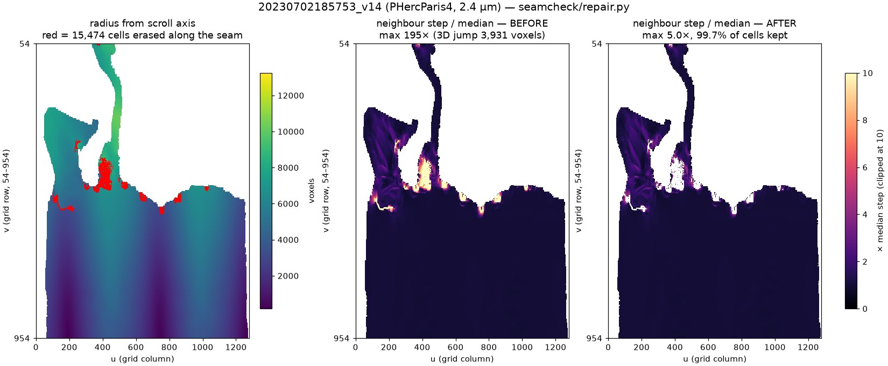

# seamcheck

**Find where a papyrus surface trace jumped to the wrong sheet — and cut it out — without a GPU.**

**Results for the whole open dataset** — 1,246 surface representations, 322 segments, 45 scrolls —
are on Hugging Face: [kimhyunwoo/vesuvius-seam-continuity](https://huggingface.co/datasets/kimhyunwoo/vesuvius-seam-continuity).
No need to run anything to use them. What was found is in [FINDINGS.md](FINDINGS.md).

Vesuvius Challenge [Open Problem #3](https://scrollprize.org/2026_open_problems) asks for tools that
catch mesh-tracing errors "like holes, mergers, and sheet switches without a human checking every
traced piece." `seamcheck` is a first, deliberately small step at that: a continuity test on the
`tifxyz` surface representation, and now **an automatic repair** (`repair.py`) that erases the
seam and writes the corrected surface back out as `tifxyz`.

## Repair, measured on the whole corpus



`repair.py` cuts every grid link whose 3D step exceeds 5× the segment's own median step, erases one
cell per cut link (the one touching more bad links, so the seam goes as a single line), and writes
the result in the same `tifxyz` format with the original grid coordinates — so it drops straight
into flattening and ink detection.

We ran it on **every representation of the 96 flagged segments (442)** and, as a control, on
**every representation of 40 randomly chosen clean segments (185)**. The check that matters is the
second one below: repair uses 3D distance, so re-measuring distance afterwards proves nothing. The
**winding check** (angular continuity around the scroll axis) is never used by the repair, so it is
an independent test of whether the surface actually got better. The winding checker was applied
unchanged before, after and to the controls.

| | flagged (442) | control (185) |
|---|---|---|
| area kept, median | **99.97%** | 100.00% |
| area kept, worst | 95.8% | 100.0% |
| distance verdict improved / worsened | 335 / **0** | 0 / 0 |
| **winding verdict improved / worsened** | **109 / 0** | 0 / 0 |
| winding worst-step ratio, median | **20.1× → 8.2×** | 4.3× → 4.3× |
| winding ratio up by >10% | 2 | 0 |

It improves only where there was something to fix, and touches nothing else: all 185 control
representations come back cell-for-cell identical. Per-representation numbers are in
[`results_repair.csv`](results_repair.csv).

**What it does not do.** It never split a representation into two surfaces. On
20230702185753_v14 we tried lower cut thresholds down to 2× and the "tongue" never separated. That is
the right behaviour: the segment spirals through radii 479–8,182, the tongue sits inside that range,
and it is attached to the rest smoothly elsewhere. The defect is the line where the tracer stitched it
to the wrong neighbour row — the 3,931-voxel jump — and that line is what gets erased. The residual
winding flags on v14 sit near the scroll core (median radius 599 against 3,246 overall) on cells whose
3D step is normal (median 20.1 voxels): the winding check divides arc length by radius, so it
over-reads small radii. We report that rather than retune the checker after seeing the result.

The two representations whose winding ratio rose (19.1× → 22.6×, both still REVIEW) are both
`z_dbg_gen` — the class we already could not explain (see FINDINGS.md).

```bash
python repair.py path/or/url/to/seg.tifxyz --out fixed/   # writes fixed/part00.tifxyz
python repairall.py                                       # the corpus run above
python repairsummary.py                                   # the table above
```

## The idea

A `tifxyz` segment stores, for every cell `(u,v)` of the flattened sheet, the 3D point `(x,y,z)` it
came from. Two cells that are neighbours in the grid **must** be neighbours in 3D. If the tracer
slipped onto the next wrap of the scroll, the trace is still topologically fine — the mesh has no
hole and no non-manifold edge — but the 3D step across that seam jumps by roughly the inter-sheet
spacing.

So: measure every neighbour step, take the median as the segment's own scale, and flag the ones
that are multiples of it.

This catches what topology checks structurally cannot see.

## Measured baseline

Normal steps are remarkably uniform inside a segment. On `PHerc0172/20250917143559` (630×687 grid,
866k neighbour pairs):

| | voxels |
|---|---|
| median step | 20.0 |
| 99th percentile | 20.8 |
| 99.9th percentile | 21.5 |
| max | 41.1 |

The whole distribution sits inside ±5% of the median, and the single worst step is 2.1× it. That
tightness is what makes the test work: a sheet switch is not a 2× outlier, it is a 10×+ one.

**Thresholds** (relative to each segment's own median, so they transfer across scans and voxel sizes):

| verdict | rule | meaning |
|---|---|---|
| `REVIEW` | ratio ≥ 10, or any step > 10× | sheet switch suspected |
| `WATCH` | ratio ≥ 5, or >0.01% of steps flagged | local discontinuity |
| `SPARSE` | valid coverage < 50% | little to judge |
| `OK` | otherwise | continuous |

## Use

```bash
pip install numpy tifffile imagecodecs scipy

python seamcheck.py path/to/tifxyz              # one local segment
python seamcheck.py --s3 PHercParis4            # a whole scroll, straight from S3
python seamcheck.py --s3 PHerc1667 --json out.json
```

Output names the worst spots in grid coordinates so a human can jump straight to them:

```
REVIEW  20250422-w031_...  ratio 31.4x  worst at (412,88) 31x
```

## Cost

Three TIFFs per segment, about 3 MB. No CT volume, no GPU, no model weights.
A 630×687 segment analyses in well under a second; the network is the only slow part.

## What this does not do

- Repair removes the seam; it does not re-trace the surface across it. The erased line is a gap.
- It cannot see a sheet switch that happens to land at the same distance as a normal step — a
  tracer that slips onto a wrap that is locally touching will pass this test.
- It says nothing about ink, and nothing about whether the surface is the *right* surface — only
  whether it is *continuous*.
- Topology defects (holes, non-manifold merges, disconnected pieces) are a separate check; a mesh
  scanner for those is in `meshcheck.py`, and the two are complementary.

## Licence

MIT-0 / public domain. Data from the
[Vesuvius Challenge open dataset](https://scrollprize.org/data) (CC BY 4.0).

---

## Three checks, not one

A trace can fail in ways that only one of these can see.

| check | reads | catches | blind to |
|---|---|---|---|
| `seamcheck.py` | `tifxyz` | sheet switch that moves in 3D | a switch onto a *touching* wrap |
| `windcheck.py` | `tifxyz` | sheet switch that changes winding | anything near the scroll axis |
| `meshcheck.py` | `.obj` | holes, mergers, split pieces | sheet switches (mesh stays manifold) |

### windcheck: winding number

`seamcheck` measures distance. But where the scroll is tightly compressed, the next
wrap is only a few voxels away, and a trace that slips onto it barely moves in 3D.
What always changes is *which wrap you are on*.

So: fit the scroll axis as the first principal component of the valid points (measured:
aligns with z to 0.992 at the median, but as poorly as 0.018 on segments too short to
constrain a direction), take the azimuth of every grid cell around it, and unwrap along
the grid's u direction. In a clean segment the angular step per cell is tight — measured
0.51°, 99th percentile 0.71°.

Two things had to be handled, and both produced a false-positive storm before they were:

1. **Gaps.** Two cells with holes between them are not neighbours. Differencing across a
   gap manufactured 66° "jumps" and blew the ratio to several hundred. Runs are now split
   at gaps and never differenced across them.
2. **The axis.** At the scroll's core the radius approaches zero, where a 20-voxel move is
   hundreds of degrees — one measured point sat 3 voxels from the axis and produced 428°.
   Cells closer than `max(200, 0.15 × median radius)` are excluded from the verdict.

With both fixed, 24 of 28 segments in PHerc1667 read `OK`, and the four that do not are
qualitatively different — not a larger number but a different kind:

| | jump rate (steps > 6× median) |
|---|---|
| the 24 `OK` segments | **0.0000%** — not one cell |
| the 4 flagged | 0.10 – 0.13% |

The same physical segment flags in independent representations at different grid
resolutions, and the flagged cells are not scattered: they line up in regular vertical
columns, about one per turn of the scroll. That is the signature of a repeating structure,
not of noise.
